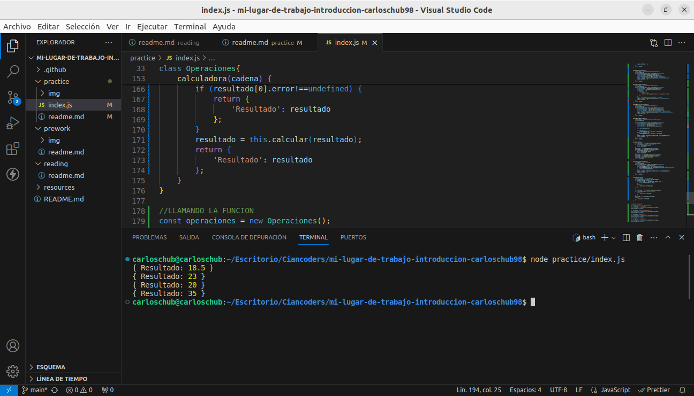

# Solución de problema

## Validaciones
    - Las validaciones estan agrupadas mediante una clase, se llama Validador
    - Tiene un metodo llamado validar, el cual cumple las siguientes funciones:
        - Validar que la cadena no este vacio
        - Validar que no exceda de 20 caracteres
        - En caso de existir errores muestra los que encuentra

## Operaciones
    - Se tiene una clase que realiza las operaciones, esta clase se llama Operaciones
    - En la clase Operaciones estan todos los metodos de raiz cuadrada, potencia, division, multiplicacion, suma y resta.
    - Para el calculo de las operaciones se toma en cuenta la jerarquia de las operaciones
    - Primero evaluamos si existe simbolo de agrupamiento que son los parentesis, en caso de existir los opera uno por uno. 
    - Cada expresion agrupada efectua los calculos respectivos y devuelve una cadena ya sin simbolos de agrupación.
    - Realizar las operaciones de raiz cuadrada en caso de que exista
    - Realizar las operaciones de potenciacion en caso de que exista, y se ve mas simplificada la cadena ya sin operaciones de potenciacion
    - Operaciones con divisiones de existir, devuelve una cadena sin operaciones de division
    - Operaciones de multiplicacion de existir, retorna una cadena sin operaciones de multiplicacion
    - Operaciones de sumas y restas, ejecuta las operaciones de resta y suma y devuelve el resultado
    - Muestra el resultado

## Observaciones
    - La evaluacion de cadenas se realiza mediantes expresiones regulares
    - Se utiliza regex para la validacion de expresiones regulares

## Evidencia de solución

