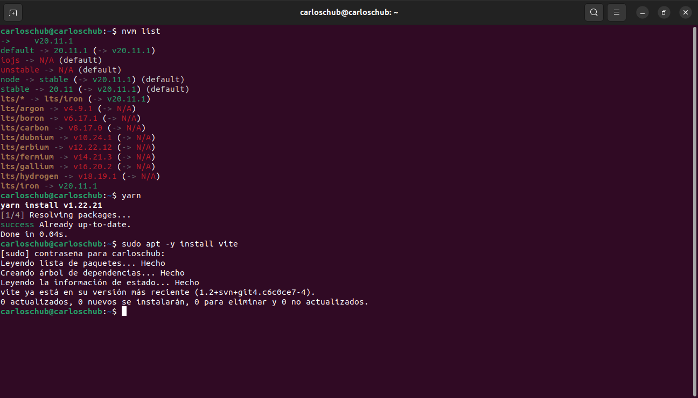
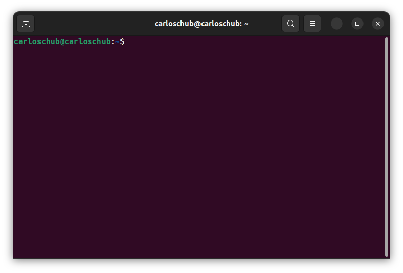

# 1. Configuración del entorno de trabajo.
    
##    Instalar los siguientes programas:
    - git

    - git flow

    - editor de código (libre)

    - Docker

    - nvm (node), yarn, vite

    - Interprete de python

    - terminal

    - Instalacion de navegador y Plugins

    
    - otros:
        - crear una cuenta de github.

        - Crear una Clave pública y privada de conexión.
